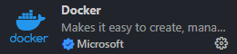
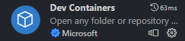
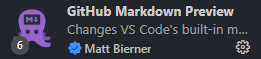
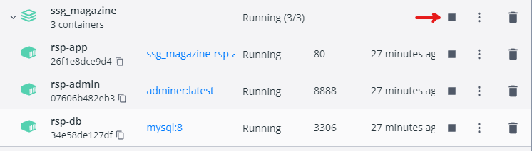
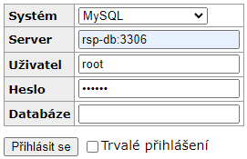
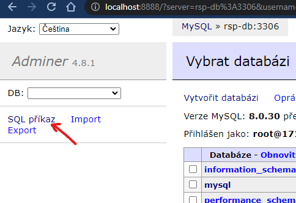
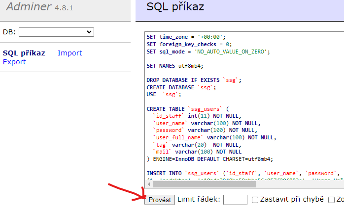

# Řízení Sowtwarových Projektů - RSP

**Team SSG**

Aplikace pro prohlížení, sběr příspěvků a administraci recenzního řízení
odborného a vědeckého časopisu

- [Prezentace 1](https://github.com/JKalina08/ssg_magazine/blob/main/docs/prezentace_1.md)

## Struktura projektu: 
```bash 
.
├── diagrams/             # ER modely 
├── docs/                 # Dokumentace k projektu
├── imgs/                 # Obrázky pro dokumentaci
├── sqldb/                # Zakládací skripty databáze            
├── www/                  # !! Složka s projektem, odtud Apache načítá "index.php" !!
├── .gitignore            # Soubor s výčtem položek které má GIT ignorovat
├── Dockerfile            # Instrukce pro sestavení Docker image Apache2 s PHP
├── README.md             # Informace o projektu a návod na zporovoznění vývoj. protředí
├── clean.sh              # Soubor pro docker-compose.yml  
├── docker-compose.yml    # Instrukce k sestavení kont. stacku Apache-Db-Admin
├── entrypoint.sh         # Soubor pro docker-compose.yml  
└── vhost.conf            # Konfigurace Apache serveru
```

  ## Instalace a zprovoznění
* Předpokladem je OS Windows 10 nebo 11. 
* Zprovozněný GIT - buď ve WSL2 nebo jako [GitBash](https://git-scm.com/download/win)-> aplikace pro Windows. 
  * Nastavení gitu (Bu+d ve WSL Bashi nebo Windows aplikace Git Bash)
    * `git config --global user.name "tvojeGitHubJmeno"`
    * `git config --global user.email "tvujEmail@domena.cz"`
    * `git config --global init.defaultBranch main`
* Nainstalovat aplikaci  [Docker](https://docs.docker.com/desktop/install/windows-install/).  
* Nainstalovat IDE [VS Code](https://code.visualstudio.com/download) pro Windows.  
  * Ve VS Code doinstalovat extenze v postraním panelu  
    * Docker  
    
    * Dev Containers  
    
    * WSL  
    
    * GitHub Markdown Preview  
    
    * Live Share  
      

* V terminálu navigujte do složky kam chcete stáhnou repozitář. 
  * `git clone https://github.com/JKalina08/ssg_magazine.git` vytvoří se vám složka "ssg_magazine", ve které jsou všechny soubory k projektu.

- Spuštění kontajnerového stacku.
  - Musíte být ve složce ssg_magazine přes terminál.
  - Zadejte příkaz `docker-compose up -d`, tím se sestaví kontajnery a jsou k jsou připraveny k použití.
    - V příštím spuštění pak přes příkaz `docker-compose start` | `docker-compose stop`.
    - Nebo přes talčítko v desktopové aplikaci "Docker Desktop".  
    
    - Nápověda: [docker-compose cheatsheet](https://devhints.io/docker-compose)
  - V prohlížeči na adrese `localhost:8888` je "adminer" pro správu databáze.
    - Přihlašte se do adminera (Heslo = secret).  
    
    - Po přihášení vyberte "SQL Příkaz".  
    
    - Zkopírujte do schránky obsah souboru `sqldb/mydatabase_new.sql` a vložte do dialogového okana a podtvrďte `Provést`.
    
    - Tímto je databáze naplněná daty a aplikace může fungovat.
    - Ve webovém prohlížeči zadejte `localhost:80` a zobrazí se vám hlavní stránka aplikace, která by nyní měla spolupracovat s naplněnou databází.


## Požadované řešení:  

Výše popsané procesy by měly být implementovány tak, aby odpadla stávající e-mailová komunikace
a všechny dokumenty, termíny, úkoly, komunikace i poznámky by byly bezpečně archivovány
v centrální databázi. Kromě toho jsou požadovány následující funkčnosti:  

* Každý autor, recenzent, redaktor i člen redakční rady musí mít vlastní bezpečný přihlašovací
profil, který může editovat.  

### Autor po přihlášení:

* Zadá název příspěvku, kontaktní údaje kompletního autorského týmu a plný text
příspěvku ve formátu pdf nebo doc(x). Všechny verze textů, které autor redakci zaslal,
zůstávají zachovány v systému včetně souvisejících doplňujících informací. Příjemná by
byla možnost doslovného textového srovnání jednotlivých verzí příspěvku (původní, po
revizi).
o Bude průběžně informován o aktuální fázi recenzního řízení (podáno, vráceno z důvodu
tematické nevhodnosti, předáno recenzentům, zamítnuto, přijato s výhradami, čeká na
dodatečné opravy ze strany autora, čeká na dodatečné vyjádření ze strany recenzenta,
čeká na vyjádření šéfredaktora, přijato).
  * Má možnost výběru tematického čísla časopisu. Přitom se zároveň dozví, jaký je o něj
aktuální zájem, tj. zná celkový počet příspěvků v recenzním řízení a kapacitu výtisku.
  * V případě nesouhlasu se závěry oponenta může redaktorovi poslat své námitky, vepsané
do oponentního formuláře.  

### Redaktor po přihlášení:

* Je informován o stavu každého příspěvku - např. nově podaný, čeká na stanovení
recenzentů, recenzní řízení probíhá a bude ukončeno 31. 10. 2020, posudek 1 doručen
redakci, posudek 2 doručen redakci, posudky odeslány autorovi, probíhá úprava textu
autorem, příspěvek je přijat k vydání nebo příspěvek zamítnut.
  * Informuje autora o stavu příspěvku (zamítnutý, k formálnímu doplnění, odeslaný do
recenzního řízení, přijatý apod.).
  * Volí recenzenty a pošle jim článek společně s termínem vypracování posudku.
  * Zpřístupní posudky recenzentů autorovi.
  * Má dostupnou evidenci všech probíhajících úkolů a termínů. Zvolené termíny jsou
automaticky hlídané a jimi dotčené role jsou s třídenním předstihem notifikovány.
  * V případě potřeby kontroluje realizaci drobných změn autory, respektive doplnění
zásadnějších informací ve spolupráci s recenzenty. K nim se korigovaný příspěvek
dostane nejvýše jednou.
  * Administrativně zajištuje veškeré problematické situace mezi autory a oponenty.
  * Předává zdrojové texty časopisu nakladatelství.  

# Recenzent:

* Recenzent po přihlášení prostuduje redaktorem předělený příspěvek, vyplní a odešle recenzní
formulář, obsahující kromě identifikátorů autora a článku následující kategoriální údaje:
  * aktuálnost, zajímavost a přínosnost
  * originalita
  * odborná úroveň
  * jazyková a stylistická úroveň  

ve stupnici 1 (nejlepší) až 5 (nejhorší). Kromě toho musí recenzní formulář obsahovat textové
pole na otevřenou odpověď a datum recenze.  

# Šéfredaktor:

* Šéfredaktor po přihlášení vidí veškerou agendu autora, redaktora i recenzentů. Změny v ní ale
samostatně provádět nesmí. Má ale možnost je písemně formulovat, například formou jmenných
úkolů a vyžadovat jejich plnění k danému termínu.   

# Čtenář:

* Čtenář se nemusí přihlašovat a vidí pouze veřejně dostupné informace.  

# Administrátor:

* Administrátor po přihlášení může kompletně spravovat celou aplikaci. Bylo by vhodné, aby měl
za tím účelem vlastní rozhraní.  

# Další požadavky:

* a) Kromě popsaných funkčností by bylo vhodné, aby kromě přidávání, mazání a prohlížení bylo
možné jednotlivé záznamy také řadit, filtrovat, vyhledávat a počítat jejich souhrny.  
* b) Aplikace by dále měla obsahovat HelpDesk, na který bude možné zasílat související dotazy. Dále
by měla mít intuitivní ovládání, měla by být opatřena on-line návodem a ideálně i kontextovými
nápovědami.  
* c) K celému řešení musí existovat dostatečná uživatelská i administrátorská dokumentace. Zdrojové
texty musí být srozumitelné, řádně komentované a splňující běžné standardy SWI.  
* d) Aplikace může být implementována buď jako webová nebo lokální. Vždy ale musí být bez jakékoli
instalace přístupná pro sponzora projektu (vyučujícího) i oponentní tým.
