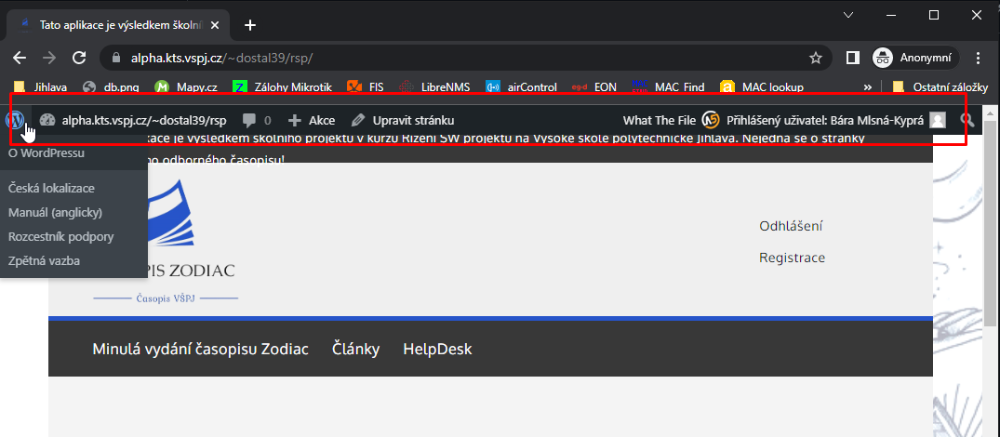
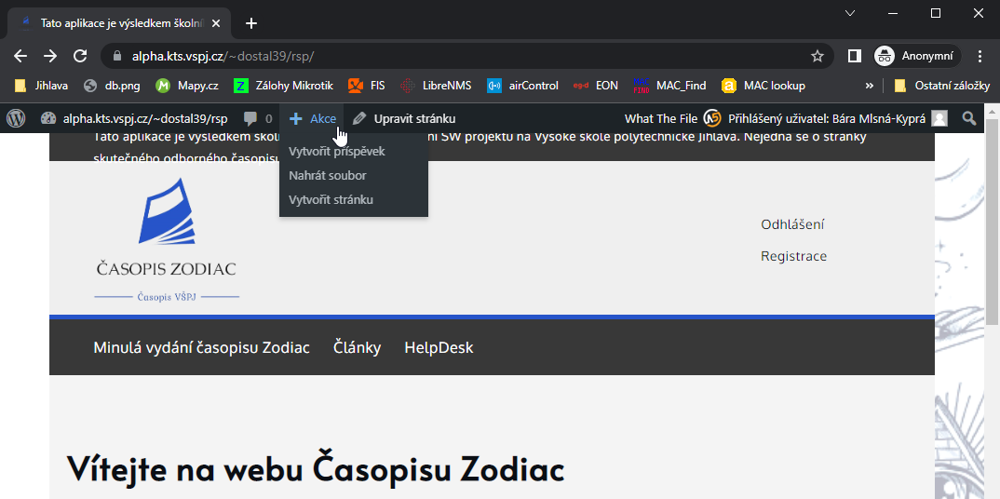
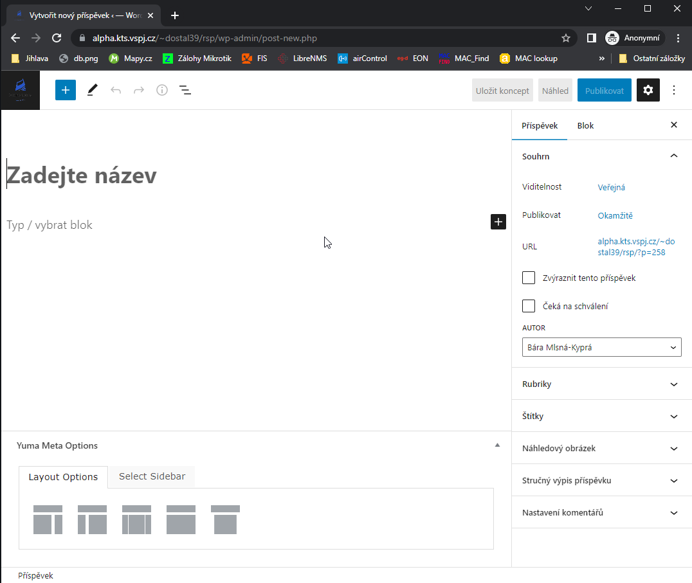
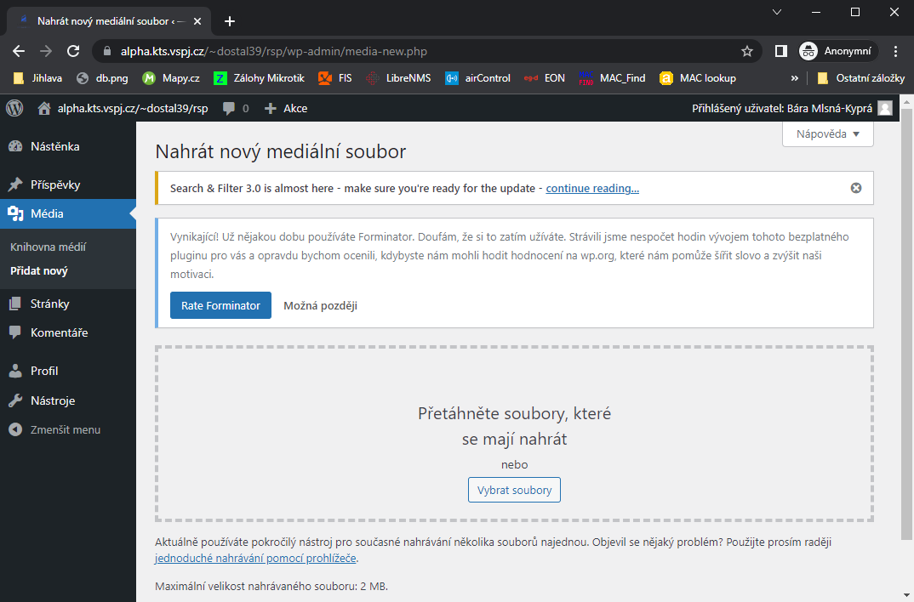
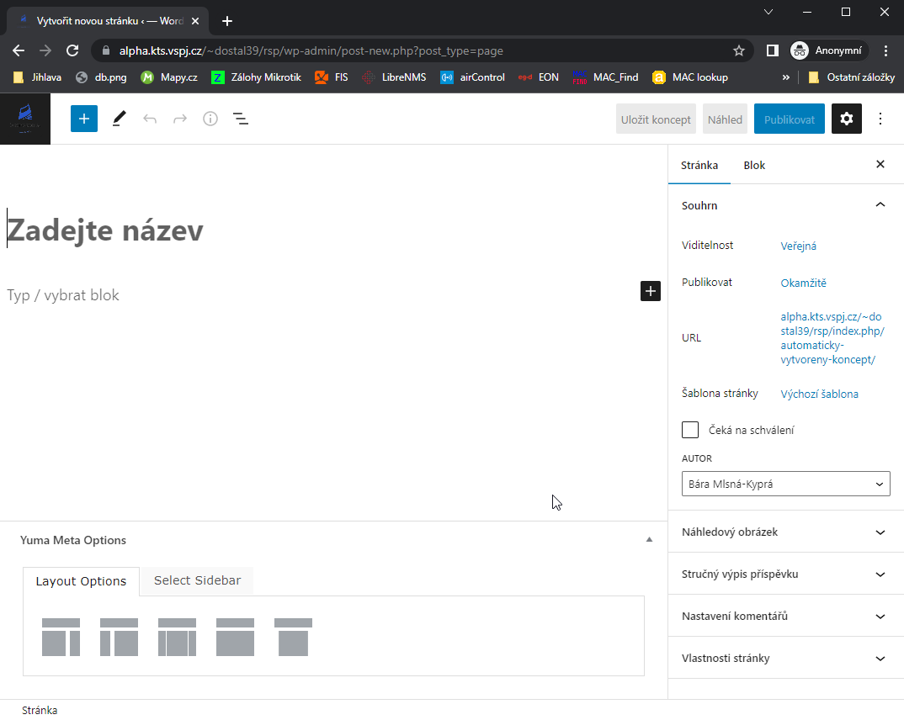
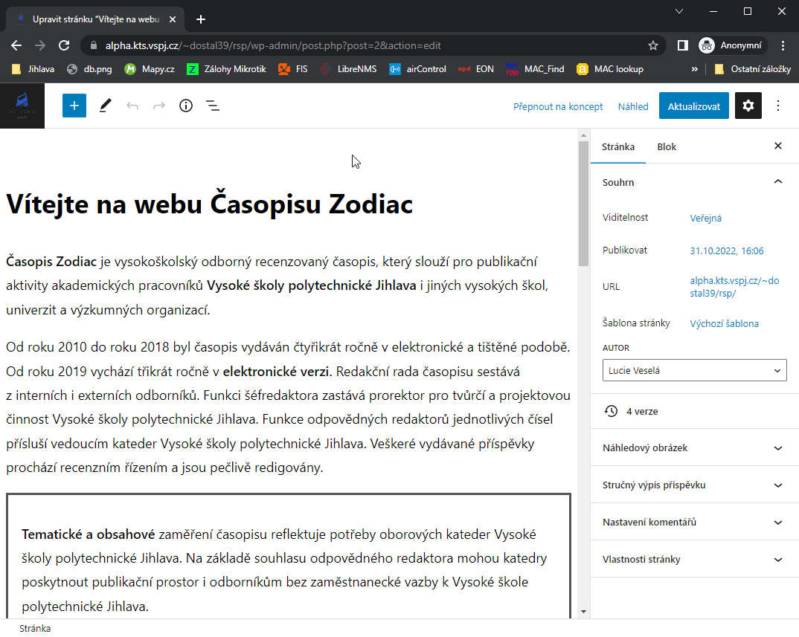

# __OPONENTURA__

* Oponentura reflektuje stav hodnoceného projektu k datu 24.11.2022  23:00

## 1) Představení oponovaného produktu

  * Oponentem hodnocený tým: Ezoterici
  * https://github.com/pmarek15/RSP_Ezoterici
  * https://alpha.kts.vspj.cz/~dostal39/rsp/

     

        Přihlašovací údaje (username - heslo):

        autor - autor

        recenzentA - recenzent

        recenzentB - recenzent

        redaktor - redaktor

        sefredaktor - sefredaktor

## 2) Stručná charakteristika jeho implementační platformy

  * webová aplikace využívající WordPress - svobodný open source redakční publikační systém napsaný v PHP a MySQL a vyvíjený pod licencí GNU GPL, grafická šablona Yuma Shark Themes, zásuvné moduly třetích stran
  * WordPress a bezpečnostní zranitelnosti __POZOR!__
  https://www.itsec-nn.com/pocet-chyb-ve-wordpressu-vzrostl-v-roce-2021-trojciferne/

## 3) Co už je hotovo a jak to funguje

### Přihlašování uživatelů
  * __přihlašování uživatelů__ :white_check_mark: - každý autor, recenzent, redaktor i člen redakční rady disponuje vlastním přihlašovacím profilem

### Role Anonymní uživatel/návštěvník stránek
  * __role GUEST__ :white_check_mark: - zobrazení příspěvků anonymním uživatelům, návštěvníkům stránek

      - problém - __Minulá vydání časopisu Zodiac__ :x: -  odkaz na stažení nejnovějšího čísla je nefunkční

     

### Role AUTOR
  * __role AUTOR__ :white_check_mark: - implementováno přidání nového příspěvku

      - problém - __Autor > Nový příspěvek__ :x: - po přidání nového příspěvku přes formulář obdrží autor odezvu systému, že byl příspěvek vložen; příspěvek jako takový se však autorovi nikde nezobrazí, nedohledá jaké příspěvky právě vložil, neví v jakém jsou stavu, jak jsou ohodnocena jednotlivá hodnotící kriteria  
      - proč je k autorovi potřeba jeho telefonní číslo? :x:

     

      - problém - __Autor > Články__ :x: - vylistuje nejnovější články v systému, nikoliv články autora

     

### Role RECENZENT
  * __role RECENZENT__ :interrobang: - není plnohodnotně implementováno?
  
      - problém - __Recenzent > Články/Nejnovější články__ :interrobang: - pod tímto odkazem z hlavní nabídky mohou recenzneti k článku pouze vkládat komentáře, nikoli recenzovat dle zadání

     

     

### Role REDAKTOR
  * __role REDAKTOR__ :interrobang: - není plnohodnotně implementováno?
  
      - problém - __Redaktor > Články/Nejnovější články__ :interrobang: - podobně jako v případě role _recenzent_ - pod tímto odkazem z hlavní nabídky lze k článkům pouze vkládat komentáře

     

     

     - Role Redaktor - zobrazení neschváleného článku, filtrování řešeno pomocí štítků:

     

     

### Role ŠÉFREDAKTOR
  * __role ŠÉFREDAKTOR__ :interrobang: - není plnohodnotně implementováno?
  
      - problém - __Šéfedaktor > Články/Nejnovější články__ :interrobang: - pod tímto odkazem z hlavní nabídky lze k článkům vkládat komentáře, nově přibyl odkaz na editaci

     

      - Editace vybraného článku přes textový odkaz "Edit"

     

      - Editace vybraného článku - přesun do útrob WordPressu - user interface hell :fire:

     

### Uživatelské rozhraní
  * defaultní __WordPress lišta__ (_WordPress Admin Bar_) v záhlaví stránky zcela rozbíjí uživatelské rozhraní a velmi snadno nasměruje uživatele do míst kam by neměl mít přístup a odkud nevede jednoduše zpětný odkaz na stránky recenzního časopisu

     

     

      - vytvořit nový WordPress příspěvek

     

      - nahrát do uložiště WordPressu multimediální soubor

     

      - vytvořit novou WordPress stránku

     

      - upravit příspěvek - úprava úvodní stránky projektu

     

      - a jiné části redakčního systému, které by uživatelům vůbec neměly být přístupné

## 4) Dílčí hodnocení v duchu hodnotícího formuláře

_xRSP, formulář pro hodnotitele_

#### Poznámky:

  * hodnocení je realizováno stupnicí 1 až 5 s významem jako ve škole
  * ke každé položce je povinný i textový komentář
  * vytýkané problémy je třeba zdokumentovat, nejlépe formou kopie obrazovky společně s datem pořízení

### 4a - Úplnost podkladů, předaných oponovaným týmem
_pokud nejste schopni z předaných podkladů realizovat hodnocení, spojte se se zástupcem hodnoceného týmu a obratem s ním tuto situaci vyřešte_

  * Hodnocení: 2
  * Komentář: nebyla dodána dokumentace k backendové části, u zvoleného řešení prostřednictvím redakčního systému by bylo vhodné uvést zejména jaké zásuvné moduly byly použity, verze všech komponent, zda (jaké) komponenty byly doprogramovány 

### 4b - Rozsah předané funkčnosti vzhledem k celkovému zadání

  * Hodnocení: 3
  * Komentář: domníváme se, že použitím "hotového řešení" pomocí redakčního systému
  se stalo i slabinou pro řešení specifických požadavků dle zadání.

### 4c - Uživatelská přívětivost hodnocené aplikace

  * Hodnocení: 2
  * Komentář: doporučujeme skrýt WordPress Admin Bar, poté možno ohodnotit známkou 1

### 4d - Chyby, zaznamenané při testování

  * Hodnocení: 2
  * Komentář: při testování se neprojevily vysloveně zjevné chyby, nedocházelo k pádům aplikace, ve výpisu generování článku se vždy na první pozici vyskytuje neplatný odkaz na stažení článku

    - spíš než o chybu šlo v mnoha případech o "vlastnost" systému, kdy jsme postrádali očekávané funkcionality dle zadání, pokud byly implementovány, tak ne zcela vhodným způsobem (viz. 4b), např. článek vydán/nevydán řešeno přes _štítky_, odkazy vedoucí dovnitř redakčního systému WordPress

### 4e - Aktuální informační hodnota portálu

_údaje o časopisu, redakční radě, způsobu publikování, obsahu časopisu apod._

  * Hodnocení: 3
  * Komentář: bylo by vhodné ve zbývajícím čase doplnit.

### 4f - Subjektivně vnímaná kvalita (co se povedlo a co ještě potřebuje vylepšit)
  * Hodnocení: 3
  * Komentář: je to WordPress, redakční (blogovací) systém pro publikaci článku a zvolit/naprogramovat/nastavit vhodné zásuvné moduly pro naše potřeby přesně dle zadání je v daném kontextu pravděpodobně náročnější než vytvořit vlastní řešení _z čistě vody_, např. pomocí PHP, MySQL

### 4g - Užitečnost uživatelské dokumentace
  * Hodnocení: 1
  * Komentář: vzhledem k rozsahu funkcionalit bez výhrad

### 4h - Užitečnost administrátorské dokumentace
  * Hodnocení: -
  * Komentář: viz 4a - nebyla dodána dokumentace k backendové části, u zvoleného řešení prostřednictvím redakčního systému by bylo vhodné uvést zejména jaké zásuvné moduly byly použity, verze všech komponent, zda (jaké) komponenty byly doprogramovány

### 4i - Další doporučení hodnocenému týmu:
  * doporučejeme v nastavení redakčního systému skrýt všem uživatelům WordPress lištu (WordPress Admin Bar)
  * https://themeisle.com/blog/hide-wordpress-admin-bar/

## 5) Celkové hodnocení (1-5)
  * Komentář: Snažili jsme se býti kritičtí, tak, jak by asi byl zadavatel, 
  který za produk platí, věříme, že si to u dálkových studentů můžeme dovolit. V rámci studia však víme, kolik času a úsilí tento projekt vyžaduje a kvalita požadovaná v
  zadání se dle našeho názoru nemůže vejít do 70h Agile-vývoje na člověka +20h režie.

  * Po zvážení výše uvedeného, udělujeme celkovou známku:  
      > ## 2 :four_leaf_clover:

## 6) Doporučení pro závěrečnou fázi vývoje
  * implementovat základní požadované MUST HAVE funkcionality 

## 7) Případné dotazy na členy hodnoceného týmu
  * pokud byste stáli znovu před výběrem vhodného řešení/nástrojů pro realizaci projektu, vybrali byste si znovu redakční systém WordPress?

    - Proč ano/ne? Případně jakou byste zvolili alternativu. 