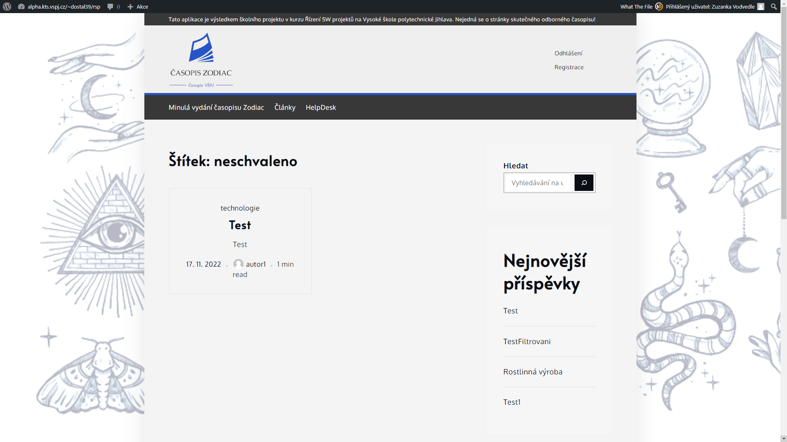

# __OPONENTURA__

_26. 11. 2022_

# 1) Představení oponovaného produktu

  * Oponentem hodnocený tým: Ezoterici
  * https://github.com/pmarek15/RSP_Ezoterici
  * https://alpha.kts.vspj.cz/~dostal39/rsp/

     

        Přihlašovací údaje (username - heslo):

        autor - autor

        recenzentA - recenzent

        recenzentB - recenzent

        redaktor - redaktor

        sefredaktor - sefredaktor

# 2) Stručná charakteristika jeho implementační platformy

  * webová aplikace využívající WordPress - svobodný open source redakční publikační systém napsaný v PHP a MySQL a vyvíjený pod licencí GNU GPL, grafická šablona Yuma Shark Themes, zásuvné moduly třetích stran

# 3) Co už je hotovo a jak to funguje

## Přihlašování uživatelů
  * __přihlašování uživatelů__ :white_check_mark: - každý autor, recenzent, redaktor i člen redakční rady disponuje vlastním přihlašovacím profilem

## Role Anonymní uživatel/návštěvník stránek
  * __role GUEST__ :white_check_mark: - zobrazení příspěvků anonymním uživatelům, návštěvníkům stránek

      - problém - __Minulá vydání časopisu Zodiac__ :x: - hned první odkaz na stažení nejnovějšího čísla je nefunkční

     

## Role AUTOR
  * __role AUTOR__ :white_check_mark: - implementováno přidání nového příspěvku

      - problém - __Autor > Nový příspěvek__ :x: - po přidání nového příspěvku přes formulář obdrží autor odezvu systému, že byl příspěvek vložen; příspěvek jako takový se však autorovi nikde nezobrazí, nedohledá jaké příspěvky právě vložil, neví v jakém jsou stavu, jak jsou ohodnocena jednotlivá hodnotící kriteria

     

      - problém - __Autor > Články__ :x: - vylistuje nejnovější články v systému, nikoliv články autora

     

## Role RECENZENT
  * __role RECENZENT__ :interrobang: - není implementováno?
  
      - problém - __Recenzent > Články/Nejnovější články__ :interrobang: - pod tímto odkazem z hlavní nabídky mohou recenzneti k článku pouze vkládat komentáře, nikoli recenzovat dle zadání

     

     


## Role REDAKTOR
  * __role REDAKTOR__ :interrobang: - není implementováno?
  
      - problém - __Redaktor > Články/Nejnovější články__ :interrobang: - podobně jako v případě role _recenzent_ - pod tímto odkazem z hlavní nabídky lze k článkům pouze vkládat komentáře

     

     

     - Role Redaktor - zobrazení neschváleného článku, filtrování řešeno pomocí štítků:

     

     


## Role ŠÉFREDAKTOR
  * __role ŠÉFREDAKTOR__ :interrobang: - není implementováno?
  
      - problém - __Šéfedaktor > Články/Nejnovější články__ :interrobang: - pod tímto odkazem z hlavní nabídky lze k článkům vkládat komentáře, nově přibyl odkaz na editaci

     

      - Editace vybraného článku přes textový odkaz "Edit"

     

      - Editace vybraného článku - přesu do útrob WordPressu - user interface hell :fire:

     


..

..

..


tohle barvičkový dole smazat...

Done? | Name
:---:| ---
:white_check_mark: | Každý autor, recenzent, redaktor i člen redakční rady musí mít vlastní bezpečný přihlašovací profil, který může editovat. :heavy_check_mark: **SPLNĚNO BEZ VÝHRAD** :heavy_check_mark:
:white_check_mark: | funkcionalita 1 :heavy_check_mark: **SPLNĚNO BEZ VÝHRAD** 
:ballot_box_with_check: | funkcionalita 2 :ballot_box_with_check: **SPLNĚNO S VÝHRADAMI** :heavy_check_mark:
:white_large_square:| funkcionalita 3 :heavy_exclamation_mark: **NEFUNKČNÍ ŘEŠENÍ** :heavy_exclamation_mark: 
:white_large_square:| funkcionalita 4 :x: **NEIMPLEMENTOVÁNO** :x:
:white_large_square:| funkcionalita 5 :interrobang: **NEZNÁMÝ STAV** :interrobang:
:white_check_mark:| DDD
:ballot_box_with_check: | EEE
:interrobang: | FFF
:x: | GGG
:heavy_exclamation_mark: | HHH
:bangbang: | III
:heavy_multiplication_x: | JJJ
:heavy_plus_sign: | KKK
:heavy_minus_sign: | LLL
:clock9: | MMM
:clock930: | NNN


_barvy?_

```diff
- text in red
+ text in green
! text in orange
# text in gray
@@ text in purple (and bold)@@
```

_emoji_

https://gist.github.com/rxaviers/7360908

# 4) Dílčí hodnocení v duchu hodnotícího formuláře

_xRSP, formulář pro hodnotitele_

### Poznámky:

  * hodnocení je realizováno stupnicí 1 až 5 s významem jako ve škole
  * ke každé položce je povinný i textový komentář
  * vytýkané problémy je třeba zdokumentovat, nejlépe formou kopie obrazovky společně s datem pořízení


## 4a - Úplnost podkladů, předaných oponovaným týmem
_pokud nejste schopni z předaných podkladů realizovat hodnocení, spojte se se zástupcem hodnoceného týmu a obratem s ním tuto situaci vyřešte_

  * Hodnocení:
  * Komentář:


## 4b - Rozsah předané funkčnosti vzhledem k celkovému zadání

  * Hodnocení:
  * Komentář:


## 4c - Uživatelská přívětivost hodnocené aplikace

  * Hodnocení:
  * Komentář:


## 4d - Chyby, zaznamenané při testování

  * Hodnocení:
  * Komentář:


## 4e - Aktuální informační hodnota portálu

_údaje o časopisu, redakční radě, způsobu publikování, obsahu časopisu apod._

  * Hodnocení:
  * Komentář:


## 4f - Subjektivně vnímaná kvalita (co se povedlo a co ještě potřebuje vylepšit)
  * Hodnocení:
  * Komentář:


## 4g - Užitečnost uživatelské dokumentace
  * Hodnocení:
  * Komentář:


## 4h - Užitečnost administrátorské dokumentace
  * Hodnocení:
  * Komentář:


## 4i - Další doporučení hodnocenému týmu:
  * ...

# 5) Celkové hodnocení (1-5)
  * ...

# 6) Doporučení pro závěrečnou fázi vývoje
  * ...

# 7) Případné dotazy na členy hodnoceného týmu
  * ...