# Úvodní týmová prezentace

## __(1) Představení týmu a jeho členů__
  * Jiří Kalina (PO) :pushpin:
  * Michal Makovec (SM) :chart_with_downwards_trend:
  * Jiří Karmasin (TM) :gem:
  * Jiří Bukovský (TM) :pill:
  * ~~Flowee Pospíšilová (TM)~~ :tulip:

## __(2) Stručná charakteristika implementační platformy__
   * 
   
     
   
     
   
   
   
   
   - Instalace viz [README.md](https://github.com/JKalina08/ssg_magazine) projektu :paw_prints:.
   - Vše v jednom IDE, používáme minimum ostatních aplikací.
      - Prezentace a dokumentace v markdownu.
      - 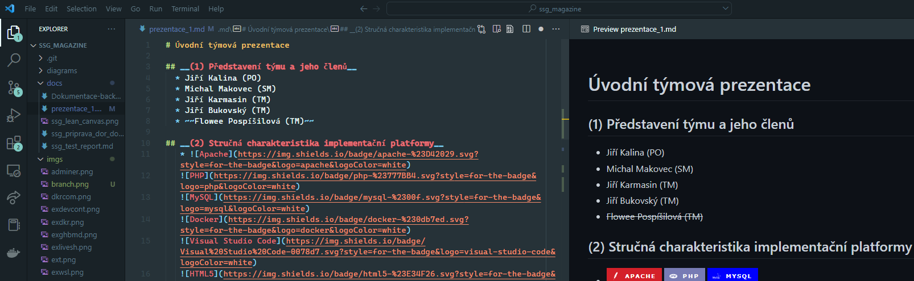  

   - ER modelování přes web aplikaci [diagrams.net](https://app.diagrams.net/) napojenou přímo do repozitáře GitHubu.
      - 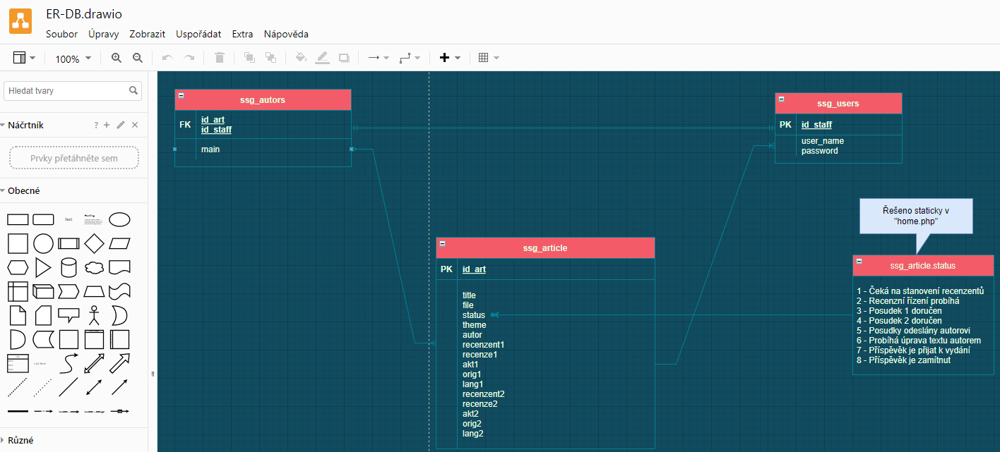  
   - Striktně __GIT -> GitHub__ ale bez "Branches"  
      - Před zpočetím práce na lokálu `git pull`
      - Po skončení práce `git commit -m "feature-x ready"` a následně `git push`, aby se změny uložily na GitHub.
      -   
   * Nejvíce předmětů a hodin strávených v HTML, CSS, PHP, JavaScript.

## __(3) Co už je hotovo a na čem právě pracujete__  

### :rocket: Sprint 1 - dva dny před koncem sprintu.
   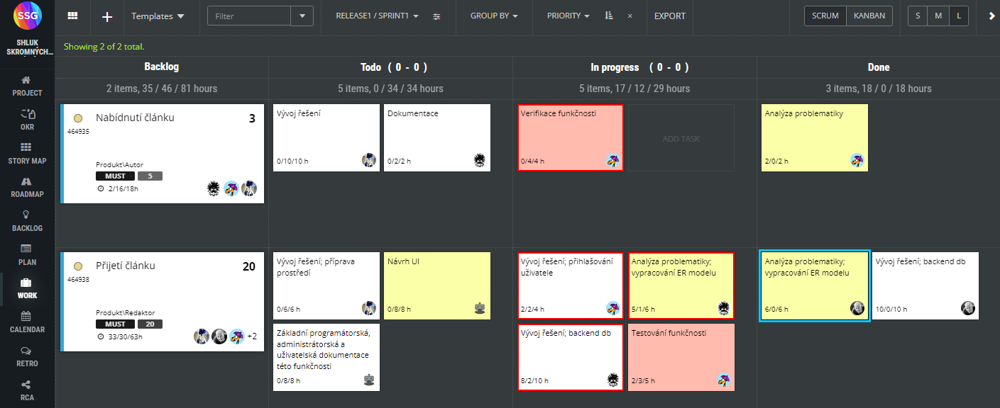  

### Storymap
   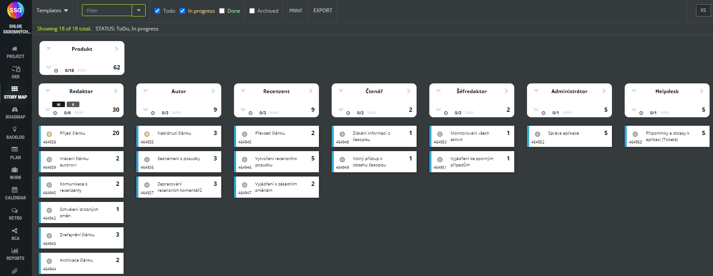

### Sprint 1 - Konec
:four_leaf_clover:[Odkaz na funkční aplikaci](https://alpha.kts.vspj.cz/~karmasin/SSG/home.php)  

   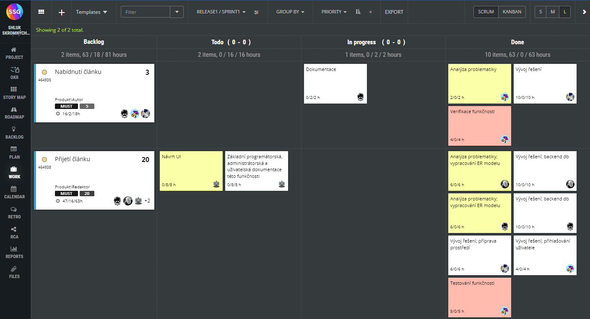

### :exclamation: Sprint 1b - viz níže oddíl (5) .
   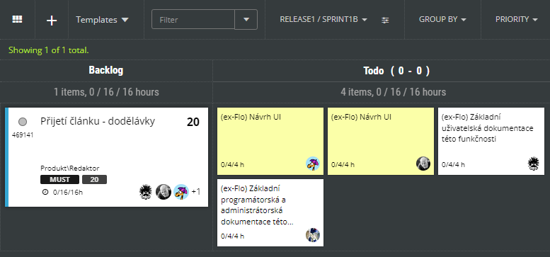  

### Sprint 2 - Start.
   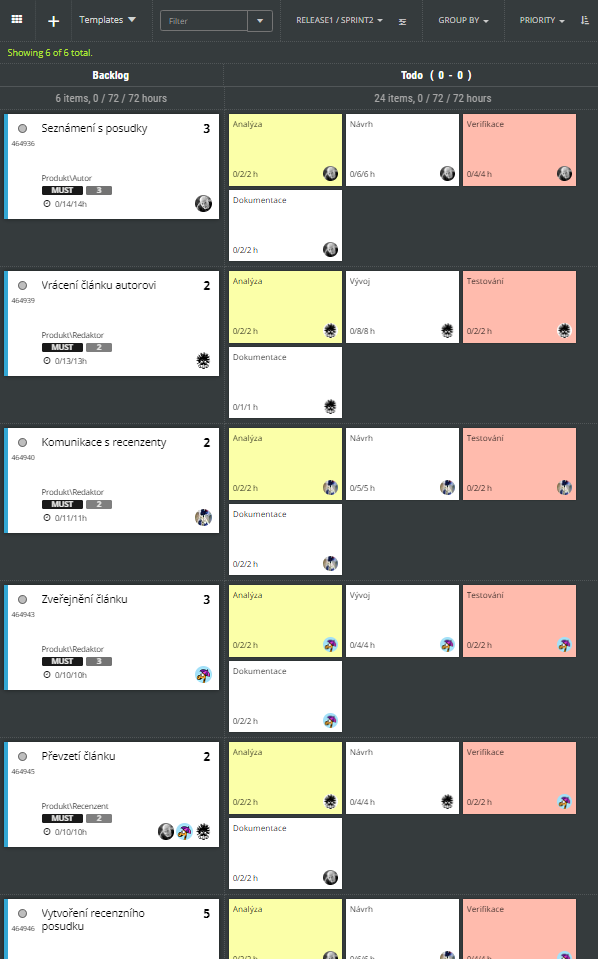  

## __(4) Poznatky týkající se:__

### Práce s týmovými nástroji

  * __Skupinová práce v Microsoft Teams__  
    * dostupnost pro různé platformy, Windows, Mac, Linux, mobilní operační systémy
    * týmová diskusní stěna a audiovizuální schůzky bez připomínek, technicky vše v pořádku
    * při zahájení schůzky nutno zmínit konkrétní(ho) uživatele a poslat mu odkaz na schůzku nebo uživatelům zaslat pozvánku k účasti přímo v probíhající schůzce, jinak se o jejím konání byť jako člen společného týmu nedozví, sic jsou v MS Teams online
    * práce s dokumenty v prostředí MS Teams - při větším počtu sdílených dokumentů nepřehledné, byť je lze topovat a záložkovat
    * pro malé a střední projekty bychom raději místo MS Teams používali kombinaci úspěšné komomunikační platformy Discord a bezplatné webové sady Google Docs Editors

  * __Připomínky k systému ScrumDesk__
    * nekompatibilita s vybranými prohlížeči - zkušenosti: Firefox nejhorší, Google Chrome nejlepší
    * stejná funkcionalita/odkaz mnohdy jednou funguje, podruhé nikoliv i v rámci stejného prohlížeče
    * nutno často i vícekrát obnovit stránku, aby ScrumDesk zobrazil aktuální hodnoty
    * pokud scrummaster přetáhne ve WORK cizí task mezi "Todo - In progress - Done", tak se automaticky přenastaví jako řešitel tohoto tasku
    * pokud člen týmu udělá při zápisu odpracovaných hodin chybu, zapíše si více hodin, tak již záznam neupraví - ScrumDesk každý další pokud o opravu záznamu považuje za další odpracované hodiny na tasku a připočte je k již aktuálně uloženým
    * postupně objevujeme užitečné drobnosti - například uživatelský checklist u každého tasku

### Týmová spolupráce

  * termíny schůzek v MS Teams domlouváme vždy s předstihem, obvykle na konci každé schůzky, na diskusní stěně
  * počáteční problémy při plánování, kdy jsme podle vzorové šablony rozplánovali ve Scrumu i úkoly, které však spadaly do režie/přípravy projektu; do detailů jsme pak rozpracovali pouze první sprint
  * velmi přínosná je soustavná komunikace s doc. Voráčkem, zejména pak online schůzka před spuštěním prvního sprintu
  * celkově příprava projektu a osvojení ScrumDesku zabrala více času než se patrně očekávalo
  * v průběhu prvního sprintu odpadl jeden člen týmu (přerušil ze zdravotních důvodů studium) - v řešení (přeplánovat práci mezi zbývající členy týmu? podaří se najít náhradníka?)

## __(5) Retrospektiva:__

### Co se nám líbilo a v čem cheme pokračovat
  * Podařilo se nám úspěšně naplánovat projekt, odstartovat první sprint
  * Nálada v týmu je výborná, věříme že to zvládneme 👍
  * Členové týmu pracují na tascích průběžně, aktivně komunikují, vzniklé problémy a nejasnosti neodkládají, ale aktivně řeší, aby nevznikaly prodlevy.
  * Vývoj aplikace v Docker-kontajner-stacku.
  * Párové programování přes VS Code LiveShare.

### Co se nám nelíbilo a co bychom chtěli změnit
  * :fire: Přišli jsme o jednoho člena týmu a tím nesplníme první sprint :fire:. Nicméně se nejedná o kritické komponenty a tudíž je možné funkční celek předat, ale dle metodiky SCRUM je potřeba celé USER-STORY přenést do dalšího sprintu nebo přenést nesplněné tasky do vyrovnávacího sprintu.

   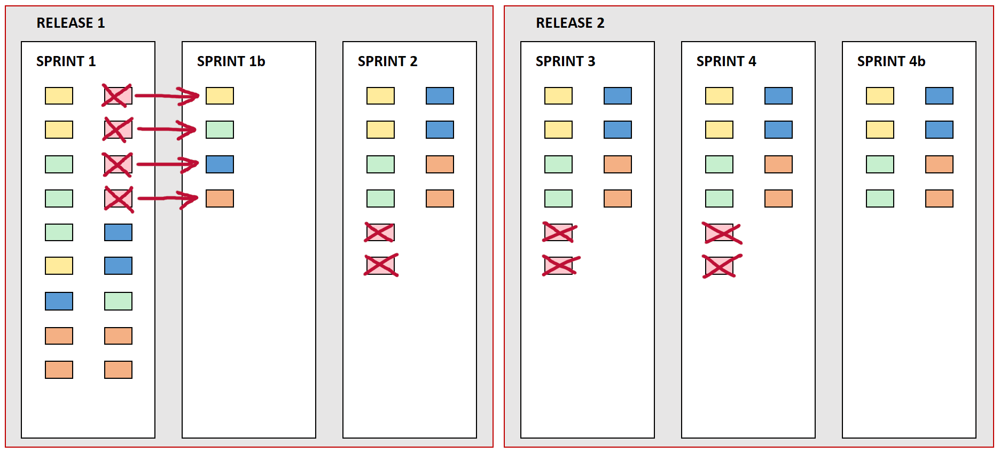  

   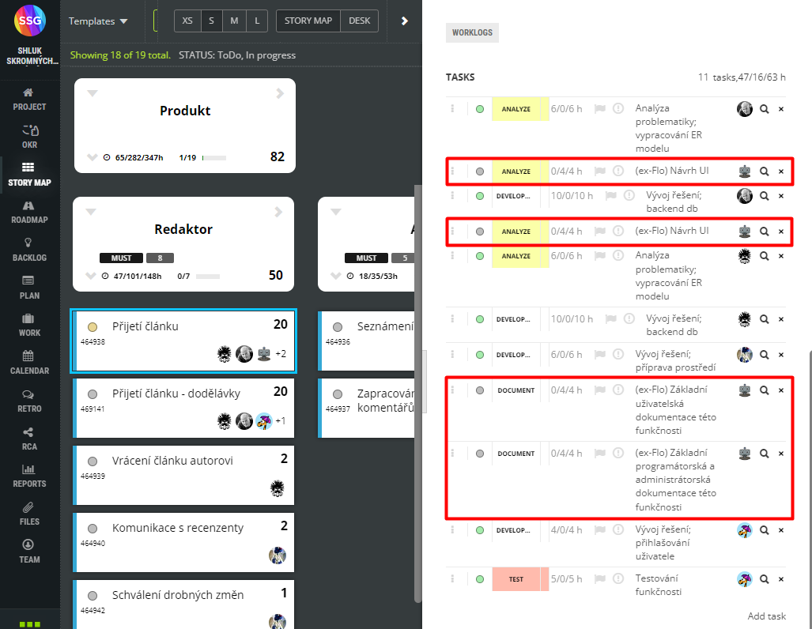
   
   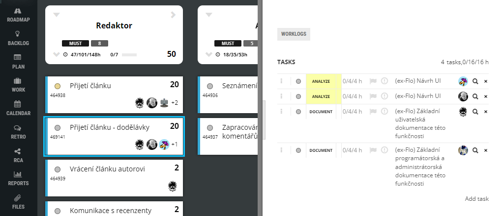  

  * Sprint1b 

   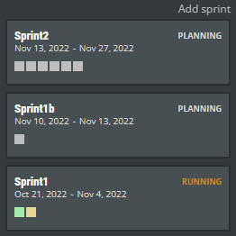  
     

  * Aktivity na projektu sice běží podle očekávání, ale vykazování práce a odpracovaných hodin ve ScrumDesku se neděje průběžně, což se mimo jiné významně (a nepříznivě) promítlo v našem burndown grafu.

  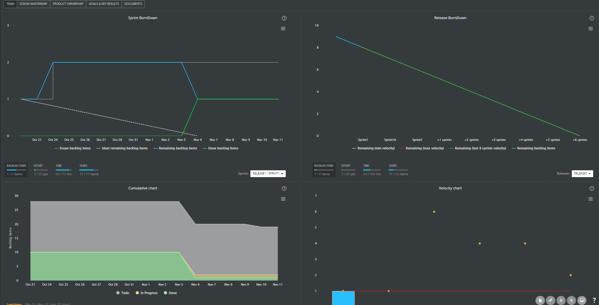  

  * linie burndown diagramu prvního sprintu byla v počáteční fázi narušena z důvodu smazání a znovuvytvoření identických tasků během spuštěného sprintu (vinou scrum mastera, který tímto způsobem administrativně opravil chybně vykázané odpracované hodiny)

  - :warning: Oslabení teamu v průběhu projektu bude pravděpodobně znamenat, méně dokončených US - soustředíme se hlavně na __must-have__.

### Co chcete vylepšit
  * Windows vs Linux file system PHP flexible. Docker je Linux, školní server bude mít Windows file systém => forward-slash vs backslash-slash.
  * Soubory přijímat v (UTF8 vs cp1250) a bez diakritiky.
  * Dokumentace, psát průběžně a nejlépe jako součást kódu, když každý děláme na něčem jiném je dokumentacu u každé funkce docela důležitá.
  * Současná dokumentace
      - [Dokumentace-backend.md](https://github.com/JKalina08/ssg_magazine/blob/main/docs/Dokumentace-backend.md)

## __(6) Případné dotazy na kolegy i vyučujícího__
* :question: Jak postupovat v situaci, kdy přijdeme o člena týmu.
- :question: Jak správně dělat dokumentaci
    -  Jako komentáře v kódu pak jí přepisovat do dokumentu? 
    - Existuje nástroj pro sestavení dokumentace z commentů v kódu?
