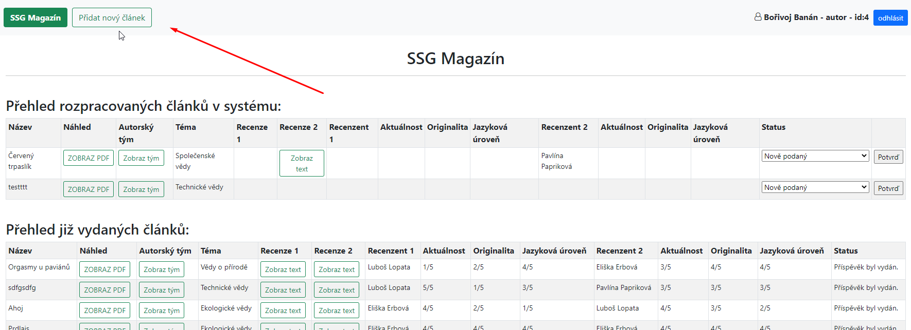

Uživatelská dokumentace
===
Cílem tohoto dokumentu je seznámit neznalého uživatele s funkcionalitou redakčního portálu časopisu SSG. V krátkosti bude vysvětlena funkčnost jednotlivých ovládacích prvků a jejich vzájemné propojení.

## (1) Login
Přihlašovací obrazovka. Je možné se přihlásit s přihlašovacím jménem a heslem, které už uživatel zná, nebo vstoupit jako neregistrovaný návštěvník.  

Loginy použitelné pro testování:  
redaktor - 123456 
lopata - 987654 (recenzent)
paprikova - qwertz (recenzent)
banan - mnbvcx (autor)
mrkev - mnbvcx (autor)

Úvodní stránka:

  

Výpis článků pro anonymního/neregistrovaného návštěvníka:

  

## (1) Domovská obrazovka
Na domovské obzarovce se v přehledných tabulkách vypisují všechny články, které jsou uloženy v databázi systému. Tabulky jsou dvě. Horní obsahuje články, které jsou ještě nevydané. To znamená například články čerstvě nahrané autorem, články, kde se čeká na vytvoření recenzního posudku nebo přiřazení recenzenta apod. Tato tabulka je viditelná pouze pro role šéfredaktor, redaktor, recenzent a autor. Návštěvníklům je skryta.  

* __Redaktor__ a šéfredaktor vidí kompletní tabulku, ale nemohou editovat texty posudků a číslená hodnocení kritérií. Mohou článku přiřadit recenzenty a článek prohlásit za schválený a tím ho vydat (přesunout do archivu).

  

* __Autoři__ vidí pouze jimi vydané články a mouhou se seznamovat s posudky

  

* __Recenzenti__ vidí jen články, které jim byly přidány k recenzníému řízení a mohou upravovat hodnocení a text recenze u daných článků.

  

__Po každé změně v ovládacích prvcích daného článku je třeba stiskem tlačítka "Potvrď" na konci řádku zapsat tyto změny do databáze__

__Předávání článků mezi jednotlivými rolemi se děje pouze změnou stavu ve sloupci Status__ - to se zatím neděje automaticky

  

Druhá tabulka obsahuje články, které již byly zrecenzovány, autorem posudky schváleny a redaktorem byl článek vydán. Návštěvníci vidí kompletní archiv. Jiná přihlášená role vidí pouze vydané články, na kterých participovala.

  

__Redaktor může__ také __vytvořit nového autora__ nebo __recenzenta__. Tím je zpřístupní pro výběr při tvorbě novéhp článku.

  

  

## (2) Přidat nový článek
Formulář, který je dostupný pouze roli "autor". Vytváří se jím nový záznam z databáze. 

  

* Název článků je volný text
* Témata k výběru jsou pevně danná
* Seznam autorů bere pouze autory, kteří jsou zaneseni v systému. Pole může zůstat nezměněno.
* Soubor k nahrání - povoleny jsou pouze formáty .doc a .doc/.docx. Při ukládání na serveru se do názvu souboru přidá postfix s timestampem, aby nedocházelo ke kolizi stejně pojmenovaných souborů.

  

A pokud jste dočetli až sem a nejste přesvědčeni o tom, že to „funguje“, že z pařezů vyraší nové výhony, že plocha, která se vám po vymýcení nezdravého porostu zdá navždy prázdnou, se opět zazelená... počkejte do jara. Děkujeme za pozornost!
 --Tým SSG